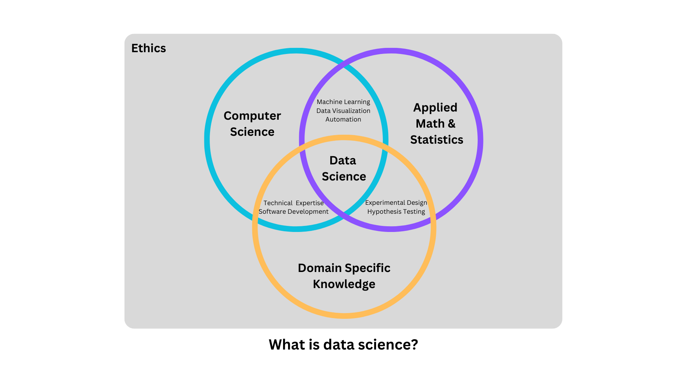

```{r, include = FALSE}
ottrpal::set_knitr_image_path()
```

# What is data science?

Study and use of computational skills within the field of biology may be described as data science, computational biology, or bioinformatics. While these terms may be used interchangeably by some, they do have distinctions. Specifically computational biology and bioinformatics are considered a subset of data science where in each case biology is the "domain specific knowledge" aspect of data science. Data science has been described as an interdisciplinary study combining computer science, applied math & statistics, and domain specific knowledge. That domain specific knowledge could be from any field with data: sociology, business, education -- or in the case of computational biology/bioinformatics -- biology.

The Venn diagram below displays a model of this interdisciplinary view of data science and takes it a step further, encapsulating each subdivision and data science as a whole within the frame of ethics, as described in a PLOS Biology perspective of data science [@Bourne_2021].  



(Add a distinction for computational biology and bioinformatics here?)

# Motivations for computational work

# How does a researcher approach computional work?

# Examples of the application of computational work to wet lab research

# Rigor and ethics in computional work

# Why learn computational skills yourself

# Which computational skills are the most important to prioritize learning as a wet lab scientist

## Data Wrangling

## Data Visualization

## Reproducibility and Transparency

## Sharing and reusing public data, code, or tools

In conclusion, the benefits of knowing computational skills as a wet lab scientist ... 